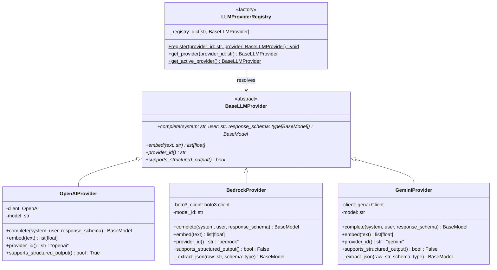
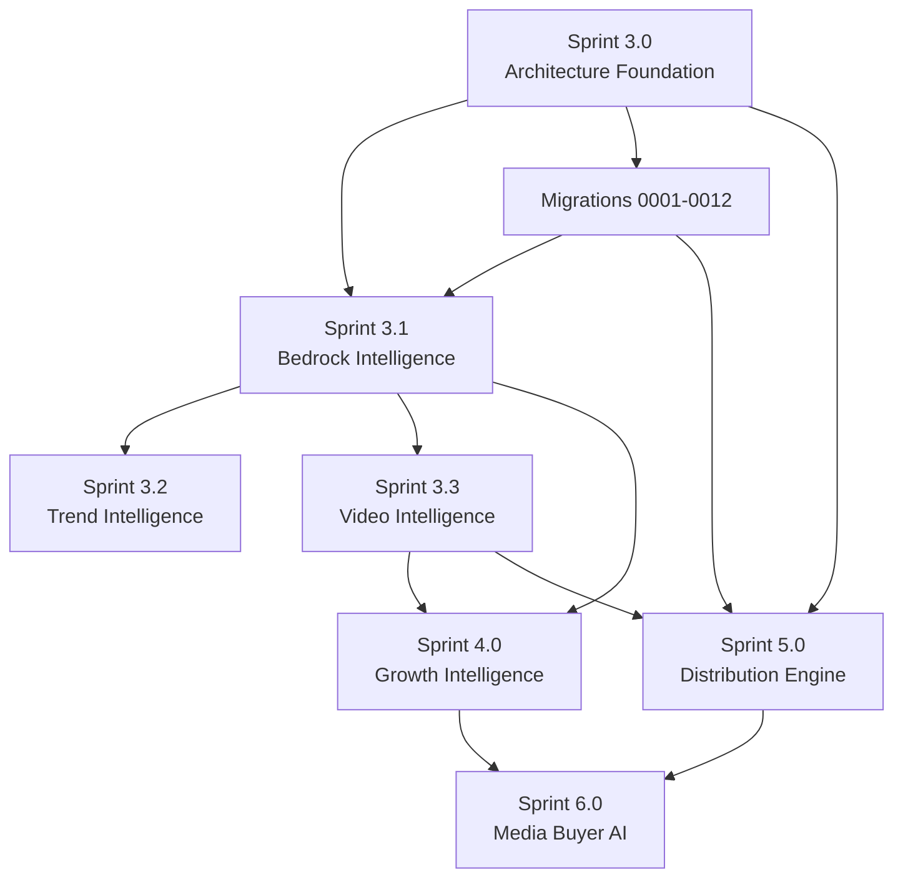

# Sprint 3.0 Architecture Foundation — Design Document

## Overview

Sprint 3.0 produces no user-facing features. It is a pure architecture sprint whose output is a set of
decisions, contracts, migration plans, and interface specifications that every subsequent sprint (3.1
through 6) depends on before writing a single line of implementation code.

The AutoMind AI backend (FastAPI + PostgreSQL + SQLAlchemy 2 + Celery + Redis) completed Sprints 1 and
2 with: the 12-step LLM campaign pipeline, CampaignJob/ActivityEvent audit trail, Celery task
orchestration, AssetService (S3/CloudFront), and Stripe/Razorpay billing. A codebase audit identified
11 structural gaps that, if left unresolved, would accumulate into blocking technical debt by Sprint 3.3.

This document delivers all nine architecture artifacts: dependency graph, marketing data model review,
Alembic migration roadmap, event architecture, agent architecture, LLM provider architecture, credit
cost matrix, asset architecture review, and sprint roadmap.

---

## Architecture

### System Topology

```
┌──────────────────────────────────────────────────────────┐
│  FastAPI Application (async)                              │
│  ┌──────────┐  ┌──────────┐  ┌──────────┐  ┌─────────┐  │
│  │ Routers  │  │ Services │  │  Agents  │  │   WS    │  │
│  └─────┬────┘  └────┬─────┘  └────┬─────┘  └────┬────┘  │
│        └────────────┴─────────────┴──────────────┘        │
│                         │                                  │
│              SQLAlchemy 2 ORM (async)                      │
└────────────────────────┬─────────────────────────────────┘
                         │
              ┌──────────┴──────────┐
              │   PostgreSQL 15      │
              └──────────┬──────────┘
                         │
        ┌────────────────┴────────────────┐
        │          Redis (broker)          │
        └────────────────┬────────────────┘
                         │
              ┌──────────┴──────────┐
              │   Celery Workers     │
              │  (AgentRunner loop)  │
              └─────────────────────┘
```

The architectural refactor for Sprint 3.0 introduces three new abstraction layers:

1. **AgentRunner** — a lifecycle coordinator that enforces credit gating, job tracking, and event
   emission uniformly across all agent executions.
2. **LLMProviderRegistry** — a factory that decouples the campaign pipeline from OpenAI specifics,
   enabling AWS Bedrock and Google Gemini as drop-in providers.
3. **EventEnvelope** — a standardised JSON wrapper that replaces ad-hoc event strings with a
   versioned, structured schema consumed by the WebSocket gateway and ActivityEvent audit log.

---


## Deliverable 1: Dependency Graph

### 1.1 Entity-Relationship Diagram

```mermaid
erDiagram
    users {
        string id PK
        string email
        string password_hash
        string plan
        int credits
        int credits_reserved
        datetime rate_limit_reset
        datetime created_at
    }

    videos {
        string id PK
        string user_id FK
        string prompt
        string status
        string url
        int duration_s
        datetime created_at
    }

    agents {
        string id PK
        string user_id FK
        string kind
        string name
        bool enabled
        json config
    }

    workflows {
        string id PK
        string user_id FK
        string name
        json nodes
        json edges
        bool enabled
    }

    social_posts {
        string id PK
        string user_id FK
        string platform
        string content
        datetime scheduled_at
        datetime published_at
        string status
    }

    campaigns {
        string id PK
        string user_id FK
        string website_url
        string product_url
        text product_description
        text brand_information
        text target_audience
        string campaign_goal
        string status
        datetime created_at
    }

    campaign_jobs {
        string id PK
        string user_id FK
        string campaign_id FK
        string job_type
        string status
        int credits_reserved
        datetime started_at
        datetime completed_at
        text error_message
        datetime created_at
    }

    personas {
        string id PK
        string campaign_id FK
        string name
        string demographics
        string job_role
        json pain_points
        json goals
        json motivations
        json buying_triggers
        json objections
        datetime created_at
    }

    competitor_insights {
        string id PK
        string campaign_id FK
        json competitors
        json opportunities
        text positioning
        json messaging_gaps
        json feature_gaps
        datetime created_at
    }

    angles {
        string id PK
        string campaign_id FK
        string name
        text description
        datetime created_at
    }

    hooks {
        string id PK
        string campaign_id FK
        string type
        text content
        int score
        datetime created_at
    }

    headlines {
        string id PK
        string campaign_id FK
        string platform
        text content
        datetime created_at
    }

    ctas {
        string id PK
        string campaign_id FK
        string type
        text content
        datetime created_at
    }

    ad_copies {
        string id PK
        string campaign_id FK
        string platform
        text problem
        text agitation
        text solution
        text benefits
        text cta
        datetime created_at
    }

    creative_concepts {
        string id PK
        string campaign_id FK
        string concept_name
        text visual_direction
        string marketing_goal
        json storyboard
        datetime created_at
    }

    video_scripts {
        string id PK
        string campaign_id FK
        string platform
        text hook
        text body
        text cta
        json timestamps
        datetime created_at
    }

    campaign_scores {
        string id PK
        string campaign_id FK
        int score
        json strengths
        json weaknesses
        json recommendations
        datetime created_at
    }

    assets {
        string id PK
        string user_id FK
        string campaign_id FK
        string job_id FK
        string type
        string provider
        string s3_key
        string cdn_url
        string thumbnail_s3_key
        string thumbnail_url
        string status
        int duration_seconds
        float generation_cost_usd
        int credits_used
        json metadata_info
        datetime created_at
    }

    subscriptions {
        string id PK
        string user_id FK
        string plan
        string provider
        string provider_subscription_id
        string status
        datetime renewal_date
        datetime created_at
    }

    payments {
        string id PK
        string user_id FK
        string provider
        string provider_payment_id
        float amount
        string currency
        int credits_added
        string status
        datetime created_at
    }

    billing_events {
        string id PK
        string user_id FK
        string event_type
        string provider
        json payload
        datetime created_at
    }

    processed_webhooks {
        string id PK
        string provider
        datetime processed_at
    }

    activity_events {
        string id PK
        string user_id FK
        string event
        string agent
        int credits_used
        string job_id
        string campaign_id
        string asset_id
        json metadata_json
        datetime timestamp
    }

    users ||--o{ videos : "user_id (NO ondelete)"
    users ||--o{ agents : "user_id (NO ondelete)"
    users ||--o{ workflows : "user_id (NO ondelete)"
    users ||--o{ social_posts : "user_id (NO ondelete)"
    users ||--o{ campaigns : "user_id (NO ondelete)"
    users ||--o{ campaign_jobs : "user_id CASCADE"
    users ||--o{ assets : "user_id (NO ondelete)"
    users ||--o{ subscriptions : "user_id CASCADE"
    users ||--o{ payments : "user_id CASCADE"
    users ||--o{ billing_events : "user_id CASCADE"
    users ||--o{ activity_events : "user_id CASCADE"

    campaigns ||--o{ campaign_jobs : "campaign_id CASCADE"
    campaigns ||--o{ personas : "campaign_id (NO CASCADE)"
    campaigns ||--o{ competitor_insights : "campaign_id (NO CASCADE)"
    campaigns ||--o{ angles : "campaign_id (NO CASCADE)"
    campaigns ||--o{ hooks : "campaign_id (NO CASCADE)"
    campaigns ||--o{ headlines : "campaign_id (NO CASCADE)"
    campaigns ||--o{ ctas : "campaign_id (NO CASCADE)"
    campaigns ||--o{ ad_copies : "campaign_id (NO CASCADE)"
    campaigns ||--o{ creative_concepts : "campaign_id (NO CASCADE)"
    campaigns ||--o{ video_scripts : "campaign_id (NO CASCADE)"
    campaigns ||--o{ campaign_scores : "campaign_id (NO CASCADE)"

    campaign_jobs ||--o{ assets : "job_id (NO ondelete)"
    campaigns ||--o{ assets : "campaign_id (NO ondelete)"
```




### 1.2 Nodes — Complete Model Inventory

| Model | Table | PK Type | Source File |
|-------|-------|---------|-------------|
| User | users | String (UUID) | models/\_\_init\_\_.py |
| Video | videos | String (UUID) | models/\_\_init\_\_.py |
| Agent | agents | String (UUID) | models/\_\_init\_\_.py |
| Workflow | workflows | String (UUID) | models/\_\_init\_\_.py |
| SocialPost | social_posts | String (UUID) | models/\_\_init\_\_.py |
| Campaign | campaigns | String (UUID) | models/campaign.py |
| CampaignJob | campaign_jobs | String (UUID) | models/campaign.py |
| Persona | personas | String (UUID) | models/campaign.py |
| CompetitorInsight | competitor_insights | String (UUID) | models/campaign.py |
| Angle | angles | String (UUID) | models/campaign.py |
| Hook | hooks | String (UUID) | models/campaign.py |
| Headline | headlines | String (UUID) | models/campaign.py |
| CTA | ctas | String (UUID) | models/campaign.py |
| AdCopy | ad_copies | String (UUID) | models/campaign.py |
| CreativeConcept | creative_concepts | String (UUID) | models/campaign.py |
| VideoScript | video_scripts | String (UUID) | models/campaign.py |
| CampaignScore | campaign_scores | String (UUID) | models/campaign.py |
| Subscription | subscriptions | String (UUID) | models/billing.py |
| Payment | payments | String (UUID) | models/billing.py |
| BillingEvent | billing_events | String (UUID) | models/billing.py |
| ProcessedWebhook | processed_webhooks | String (provider event ID) | models/billing.py |
| ActivityEvent | activity_events | String (UUID) | models/activity.py |
| Asset | assets | String (UUID) | models/asset.py |

**Total: 23 model classes across 5 source files.**

Note: Video is classified as an **orphan** (see Gap 1/Gap 2 below). Asset is the canonical replacement.

### 1.3 Edges — FK Inventory with ondelete Rules

| Source Table.Column | Target Table.Column | ondelete Rule | Status |
|--------------------|---------------------|---------------|--------|
| videos.user_id | users.id | **MISSING** | ⚠️ Gap |
| agents.user_id | users.id | **MISSING** | ⚠️ Gap |
| workflows.user_id | users.id | **MISSING** | ⚠️ Gap |
| social_posts.user_id | users.id | **MISSING** | ⚠️ Gap |
| campaigns.user_id | users.id | **MISSING** | ⚠️ Gap |
| campaign_jobs.user_id | users.id | CASCADE | ✅ |
| campaign_jobs.campaign_id | campaigns.id | CASCADE | ✅ |
| personas.campaign_id | campaigns.id | **MISSING** | ⚠️ Gap 7 |
| competitor_insights.campaign_id | campaigns.id | **MISSING** | ⚠️ Gap 7 |
| angles.campaign_id | campaigns.id | **MISSING** | ⚠️ Gap 7 |
| hooks.campaign_id | campaigns.id | **MISSING** | ⚠️ Gap 7 |
| headlines.campaign_id | campaigns.id | **MISSING** | ⚠️ Gap 7 |
| ctas.campaign_id | campaigns.id | **MISSING** | ⚠️ Gap 7 |
| ad_copies.campaign_id | campaigns.id | **MISSING** | ⚠️ Gap 7 |
| creative_concepts.campaign_id | campaigns.id | **MISSING** | ⚠️ Gap 7 |
| video_scripts.campaign_id | campaigns.id | **MISSING** | ⚠️ Gap 7 |
| campaign_scores.campaign_id | campaigns.id | **MISSING** | ⚠️ Gap 7 |
| assets.user_id | users.id | **MISSING** | ⚠️ Gap |
| assets.campaign_id | campaigns.id | **MISSING** | ⚠️ Gap |
| assets.job_id | campaign_jobs.id | **MISSING** | ⚠️ Gap |
| subscriptions.user_id | users.id | CASCADE | ✅ |
| payments.user_id | users.id | CASCADE | ✅ |
| billing_events.user_id | users.id | CASCADE | ✅ |
| activity_events.user_id | users.id | CASCADE | ✅ |
| activity_events.job_id | **(none — untyped String)** | **NO FK** | ⚠️ Gap 5 |
| activity_events.campaign_id | **(none — untyped String)** | **NO FK** | ⚠️ Gap 5 |
| activity_events.asset_id | **(none — untyped String)** | **NO FK** | ⚠️ Gap 4 |

### 1.4 Audit Issues List

**Gap 1 — render_video bypasses credit/job/activity (Video table used, not Asset)**

`celery_app.render_video()` writes directly to the `videos` table (Video model). It never calls
`AssetService`, never creates an `Asset` row, never reserves or commits credits, and never writes an
`ActivityEvent`. The Asset model exists specifically to track media assets but is entirely bypassed by
the primary video generation task. Resolution: route `render_video` through `AgentRunner` with
`VideoIntelligenceAgent`; create an Asset row before rendering begins.

**Gap 2 — Asset model imported, never written to**

`app/models/asset.py` defines the `Asset` model with a full column set including `provider`, `s3_key`,
`cdn_url`, `status`, `credits_used`. It is imported in `models/__init__.py` and used by `AssetService`
for S3 operations, but `AssetService.process_and_upload_video()` never inserts an `Asset` row into the
database. The service computes S3 keys and uploads files but persists nothing to PostgreSQL. Resolution:
create `PublishResult` table and ensure `render_video` + `AssetService` both write Asset rows.

**Gap 3 — BaseAgent has no concrete implementations**

`app/services/agents/base.py` defines the abstract `BaseAgent` class with `run()`, `status()`, and
`history()`. No concrete subclass exists anywhere in the codebase. The agent router dispatches to Celery
task strings instead. Resolution: implement all 8 concrete agent classes as part of Sprint 3.0 interface
contracts (class hierarchy diagram, credit_cost, event_type_prefix).

**Gap 4 — ActivityEvent.asset_id and metadata_json always NULL**

`ActivityEvent.asset_id` and `ActivityEvent.metadata_json` are declared as nullable columns but are
never populated by any code path in `celery_app.py` or `campaigns.py`. Every `ActivityEvent` row
written today has `asset_id=NULL` and `metadata_json=NULL`. Resolution: add `ondelete=SET NULL` FK
constraint to `asset_id`; populate both fields in AgentRunner emit step.

**Gap 5 — ActivityEvent.job_id and campaign_id are untyped strings with no FK**

Both `ActivityEvent.job_id` and `ActivityEvent.campaign_id` are declared as `Column(String,
nullable=True)` with no `ForeignKey(...)`. They are written as raw strings in `celery_app.py` but
PostgreSQL cannot enforce referential integrity. A deleted CampaignJob or Campaign leaves orphaned
string references in `activity_events`. Resolution: migration 0002 adds proper FK constraints.

**Gap 6 — execute_workflow_task has no credit gating**

`celery_app.execute_workflow_task()` creates a Video row and dispatches `render_video` directly without
checking user credits, creating a CampaignJob, or emitting an ActivityEvent. A user could trigger
unlimited workflow executions at zero credit cost. Resolution: route through `AgentRunner`.

**Gap 7 — Campaign child tables have no ondelete=CASCADE**

Ten child tables (`personas`, `competitor_insights`, `angles`, `hooks`, `headlines`, `ctas`,
`ad_copies`, `creative_concepts`, `video_scripts`, `campaign_scores`) declare `ForeignKey("campaigns.id")`
without `ondelete="CASCADE"`. Deleting a Campaign row will raise an `IntegrityError` or leave orphaned
child rows depending on DB configuration. Resolution: migration 0001.

**Gap 8 — Campaign.product_url is dead (written but never read)**

`Campaign.product_url` is a column declared in `app/models/campaign.py`. The campaigns router likely
writes it during campaign creation, but `orchestrator.py` builds its LLM context exclusively from
`campaign.website_url`, `campaign.product_description`, `campaign.target_audience`, and
`campaign.campaign_goal`. `product_url` is never interpolated into any LLM prompt or used in any
scrape call. Resolution: either populate the context string or document as intentionally deferred.

**Gap 9 — JOB_STATUS["RESERVED"] and JOB_STATUS["REFUNDED"] never written**

`app/core/constants.py` defines `JOB_STATUS = {"RESERVED": "reserved", "REFUNDED": "refunded", ...}`.
Neither value is ever written to `CampaignJob.status`. The `CreditService.reserve_credits()` call
increments `user.credits_reserved` but does not update the job row to `status="reserved"`. After a
refund, the job status goes directly from `running` to `failed` without a `refunded` transition.
Resolution: `AgentRunner` must write these status values at the correct lifecycle points.

**Gap 10 — WebSocket sends random mock data**

`app/routers/ws.py` emits `{"type": "tick", "engagement": random.randint(40,100), "leads":
random.randint(0,8)}` every 1.5 seconds to every connected client, with no user context and no
relationship to real data. Resolution: replace with a real-time query of recent `ActivityEvent` rows
filtered by `user_id`, serialised as `EventEnvelope` JSON.

**Gap 11 — analyze_website() scrape output discarded after LLM context build**

`campaigns/analyzer.py::analyze_website()` scrapes a URL and returns a dict containing `title`,
`meta_description`, `h1`, `h2`, `main_text_snippet`, and `extracted_ctas`. In
`orchestrator.py::generate_full_campaign_sync()`, this dict is used only to interpolate values into a
context string for LLM calls. The full scrape output is never persisted to any table. Re-running the
campaign pipeline re-scrapes the same URL from scratch. Resolution: `ResearchSnapshot` table (migration
0003) persists all scrape output with a FK to the campaign.

---


## Deliverable 2: Marketing Data Model Review

### Decision Summary

| Entity | Decision | Rationale |
|--------|----------|-----------|
| ResearchSnapshot | CREATE NEW TABLE | No existing table persists website scrape output |
| CampaignContent | CREATE NEW TABLE | No join layer exists linking creative output → campaign + job + asset |
| CampaignMetrics | CREATE NEW TABLE | No time-series performance KPI table exists |
| PublishResult | CREATE NEW TABLE | SocialPost.status is a scalar field; full API response history needs its own table |
| TrendSnapshot | CREATE NEW TABLE | No trending intelligence table exists; Sprint 3.2 input source |
| BrandProfile | CREATE NEW TABLE | User-scoped brand identity is a distinct entity not representable in User or Campaign |
| Lead + LeadMagnet | CREATE TWO NEW TABLES | Leads and magnets are separate entities with different lifecycles |
| SocialAccount | CREATE NEW TABLE | OAuth token storage requires encryption-at-column-level and unique constraints not present in any existing table |

### 2.1 ResearchSnapshot

**Decision: CREATE NEW TABLE — `research_snapshots`**

**Why not extend Campaign?** Campaign already has 8 columns and represents the campaign configuration.
Embedding scrape data as JSON blobs in Campaign violates 1NF and makes the Campaign row unqueryably
large. ResearchSnapshot enables point-in-time scrape history (a product page can change between runs).

**Column List:**

| Column | Type | Constraints |
|--------|------|-------------|
| id | String | PK, UUID default |
| campaign_id | String | FK → campaigns.id, ondelete=CASCADE, index |
| url | String | NOT NULL |
| scraped_at | DateTime(tz=True) | NOT NULL, default=utcnow |
| title | String | nullable |
| meta_description | Text | nullable |
| h1_list | JSON | nullable (list of strings) |
| h2_list | JSON | nullable (list of strings, max 10) |
| main_text | Text | nullable (up to 3000 chars from scrape) |
| extracted_ctas | JSON | nullable (list of strings, max 10) |
| raw_html_s3_key | String | nullable (full HTML stored in S3 for re-processing) |

**Storage Impact:** ~10–15 KB per snapshot row (text columns). At 10,000 campaigns: ~150 MB.
Acceptable. raw_html offloaded to S3.

**Scalability:** Enables scrape cache invalidation (compare `scraped_at` to decide re-scrape).
Enables future ML features that operate on raw HTML. Enables A/B testing of LLM prompts against
cached scrape data without re-fetching URLs.

### 2.2 CampaignContent

**Decision: CREATE NEW TABLE — `campaign_content`**

**Why not extend existing child tables?** The 10 campaign child tables (personas, hooks, etc.) each
represent a specific content type. CampaignContent is a join/envelope layer that associates any
content row with the job that produced it and the asset it maps to. Adding job_id and asset_id to each
of 10 tables would create 20 new columns across 10 migrations instead of one table.

**Column List:**

| Column | Type | Constraints |
|--------|------|-------------|
| id | String | PK, UUID default |
| campaign_id | String | FK → campaigns.id, ondelete=CASCADE, index |
| job_id | String | FK → campaign_jobs.id, ondelete=SET NULL, nullable |
| asset_id | String | FK → assets.id, ondelete=SET NULL, nullable |
| content_type | String | NOT NULL: persona \| competitor \| angle \| hook \| headline \| cta \| ad_copy \| creative_concept \| video_script \| campaign_score |
| content_ref_id | String | NOT NULL (UUID of row in the relevant child table) |
| created_at | DateTime | default=utcnow |

**Storage Impact:** ~200 bytes per row. At 100 child rows per campaign, 10,000 campaigns: ~200 MB. Low.

**Scalability:** Enables cross-content queries: "which job produced which hooks?", "which hooks have
associated video assets?". Required for Sprint 4 Growth Intelligence attribution analysis.

### 2.3 CampaignMetrics

**Decision: CREATE NEW TABLE — `campaign_metrics`**

**Why not extend Campaign?** Campaign is a configuration entity; metrics are time-series operational
data. Embedding daily metrics as JSON in Campaign creates unbounded column growth and destroys
queryability. CampaignMetrics enables platform-specific daily aggregations.

**Column List:**

| Column | Type | Constraints |
|--------|------|-------------|
| id | String | PK, UUID default |
| campaign_id | String | FK → campaigns.id, ondelete=CASCADE, index |
| metric_date | Date | NOT NULL |
| platform | String | NOT NULL (meta \| linkedin \| google \| tiktok \| youtube) |
| impressions | Integer | default=0 |
| clicks | Integer | default=0 |
| conversions | Integer | default=0 |
| spend_usd | Float | default=0.0 |
| revenue_usd | Float | default=0.0 |
| created_at | DateTime | default=utcnow |

**Compound Unique Constraint:** `UNIQUE(campaign_id, metric_date, platform)` — prevents duplicate
daily platform rows; enables upsert semantics.

**Storage Impact:** ~150 bytes per row. At 5 platforms × 365 days × 10,000 campaigns: ~2.7 GB/year.
Manageable; partition by metric_date after 1M rows.

**Scalability:** Enables ROAS calculation, daily trend charts, platform comparison. Required by Sprint
6 Media Buyer AI for budget optimization decisions.

### 2.4 PublishResult

**Decision: CREATE NEW TABLE — `publish_results`**

**Why not extend SocialPost?** SocialPost.status is a scalar. A post may be retried across multiple
platforms or re-published. Each publish attempt has a distinct HTTP response, timestamp, and error.
Making SocialPost carry this history would require JSON blobs and lose queryability.

**Column List:**

| Column | Type | Constraints |
|--------|------|-------------|
| id | String | PK, UUID default |
| post_id | String | FK → social_posts.id, ondelete=CASCADE, index |
| platform | String | NOT NULL |
| provider_post_id | String | nullable (external post ID returned by platform API) |
| http_status_code | Integer | NOT NULL |
| response_body | JSON | nullable |
| published_at | DateTime(tz=True) | nullable |
| error_message | Text | nullable |

**Storage Impact:** ~500 bytes per row. At 1 result per publish task, minimal impact.

**Scalability:** Enables retry logic (query failed PublishResults to reschedule), analytics on
publish success rates per platform, and audit trail required for Sprint 5 Distribution Engine SLA.

### 2.5 TrendSnapshot

**Decision: CREATE NEW TABLE — `trend_snapshots`**

**Why not extend an existing table?** No existing table captures external trend intelligence. This
data is platform-scoped and time-stamped; it is the primary input for Sprint 3.2 TrendIntelligenceAgent.

**Column List:**

| Column | Type | Constraints |
|--------|------|-------------|
| id | String | PK, UUID default |
| captured_at | DateTime(tz=True) | NOT NULL, index |
| platform | String | NOT NULL (google_trends \| twitter \| tiktok \| manual) |
| region | String | NOT NULL (ISO 3166-1 alpha-2, e.g. "US") |
| keyword | String | NOT NULL, index |
| rank | Integer | NOT NULL |
| volume_score | Float | nullable (0–100 normalized score) |
| source | String | NOT NULL: google_trends \| twitter \| tiktok \| manual |
| metadata_json | JSON | nullable (raw API response fields) |

**Storage Impact:** ~200 bytes per row. At 100 trends/day across 5 platforms: ~36 MB/year. Low.

**Scalability:** Enables keyword trend history. Required by Sprint 3.2 for real-time trend injection
into campaign content generation. Supports Sprint 6 bid strategy decisions.

### 2.6 BrandProfile

**Decision: CREATE NEW TABLE — `brand_profiles`**

**Why not extend User?** User is an authentication entity. Brand voice, color palette, and logo are
content configuration entities. A user may also have multiple brand profiles (e.g. agency with
multiple clients). Embedding brand data in User locks the schema to one-brand-per-user.

**Column List:**

| Column | Type | Constraints |
|--------|------|-------------|
| id | String | PK, UUID default |
| user_id | String | FK → users.id, ondelete=CASCADE, index |
| brand_name | String | NOT NULL |
| tagline | String | nullable |
| tone_of_voice | JSON | nullable (list of descriptors: ["professional", "witty"]) |
| color_palette | JSON | nullable ({"primary": "#hex", "secondary": "#hex"}) |
| logo_asset_id | String | FK → assets.id, ondelete=SET NULL, nullable |
| is_default | Boolean | default=False |
| created_at | DateTime | default=utcnow |
| updated_at | DateTime | nullable, updated on write |

**Storage Impact:** ~1 KB per row. At 50,000 users: ~50 MB. Negligible.

**Scalability:** Enables multi-brand agency workflows. Required by Sprint 3.1 for injecting brand
voice into Bedrock LLM prompts.

### 2.7 Lead + LeadMagnet

**Decision: CREATE TWO NEW TABLES — `leads` and `lead_magnets`**

**Why two tables?** LeadMagnet is a reusable offer definition (an ebook, a coupon) attached to a
campaign. Lead is an individual captured contact who responded to a magnet. One magnet can produce
thousands of leads. Merging them would denormalize the magnet definition into every lead row.

**LeadMagnet Column List:**

| Column | Type | Constraints |
|--------|------|-------------|
| id | String | PK, UUID default |
| campaign_id | String | FK → campaigns.id, ondelete=CASCADE, index |
| title | String | NOT NULL |
| magnet_type | String | NOT NULL: ebook \| checklist \| webinar \| trial \| coupon |
| asset_id | String | FK → assets.id, ondelete=SET NULL, nullable (the downloadable Asset) |
| is_active | Boolean | default=True |
| created_at | DateTime | default=utcnow |

**Lead Column List:**

| Column | Type | Constraints |
|--------|------|-------------|
| id | String | PK, UUID default |
| campaign_id | String | FK → campaigns.id, ondelete=CASCADE, index |
| lead_magnet_id | String | FK → lead_magnets.id, ondelete=SET NULL, nullable |
| email | String | NOT NULL, index |
| name | String | nullable |
| phone | String | nullable |
| captured_at | DateTime(tz=True) | NOT NULL, default=utcnow |
| source_platform | String | nullable (meta \| google \| organic) |
| metadata_json | JSON | nullable |

**Storage Impact:** ~500 bytes per lead. At 1M leads: ~500 MB. Add index on email.

**Scalability:** Enables email-based deduplication, lead scoring (Sprint 4), and CRM export. Leads
table is the Sprint 4 Growth Intelligence primary input table.

### 2.8 SocialAccount

**Decision: CREATE NEW TABLE — `social_accounts`**

**Why not extend User?** OAuth tokens are sensitive, platform-specific, have expiry semantics, and
require per-row encryption. Embedding them in User creates unbounded columns (one pair per platform)
and makes rotation difficult. SocialAccount supports multiple accounts per platform per user
(agency use case).

**Column List:**

| Column | Type | Constraints |
|--------|------|-------------|
| id | String | PK, UUID default |
| user_id | String | FK → users.id, ondelete=CASCADE, index |
| platform | String | NOT NULL (instagram \| linkedin \| tiktok \| youtube \| meta) |
| provider_account_id | String | NOT NULL (platform's user/page ID) |
| access_token_encrypted | String | NOT NULL (AES-256-GCM encrypted, key from env) |
| refresh_token_encrypted | String | nullable (AES-256-GCM encrypted) |
| token_expires_at | DateTime(tz=True) | nullable |
| scopes | JSON | NOT NULL (list of granted OAuth scopes) |
| is_active | Boolean | default=True |

**Unique Constraint:** `UNIQUE(user_id, platform, provider_account_id)` — prevents duplicate OAuth
connections to the same platform account.

**Storage Impact:** ~1 KB per row (token columns are ~200 chars encrypted). At 3 platforms × 50,000
users: ~150 MB. Low.

**Scalability:** Column-level encryption means token values are never stored plaintext. Token rotation
updates a single row. Required by Sprint 5 Distribution Engine to make authenticated API calls to
social platforms.

---


## Deliverable 3: Alembic Migration Roadmap

All migrations live in `backend/alembic/versions/`. Execute in sequence; never skip a migration.
The Alembic `depends_on` chain enforces ordering at the framework level.

### 0001 — Add ondelete=CASCADE to campaign child tables

**Filename:** `0001_add_campaign_child_cascade.py`  
**Purpose:** Add `ondelete=CASCADE` to all 10 campaign child table FKs so that deleting a Campaign
row automatically removes its related content without IntegrityError.  
**Risk:** MEDIUM (alters live FK constraints on potentially non-empty tables)

**upgrade() operations:**
- `ALTER TABLE personas DROP CONSTRAINT personas_campaign_id_fkey`
- `ALTER TABLE personas ADD CONSTRAINT personas_campaign_id_fkey FOREIGN KEY (campaign_id) REFERENCES campaigns(id) ON DELETE CASCADE`
- Repeat for: `competitor_insights`, `angles`, `hooks`, `headlines`, `ctas`, `ad_copies`, `creative_concepts`, `video_scripts`, `campaign_scores`
- Verify each table via `SELECT conname, confdeltype FROM pg_constraint WHERE conname LIKE '%campaign_id%'`

**downgrade() operations:**
- For each table: drop CASCADE constraint, re-add FK without `ON DELETE CASCADE` (restores RESTRICT behavior)

### 0002 — Add FK constraints to ActivityEvent.job_id and campaign_id

**Filename:** `0002_activity_event_fk_constraints.py`  
**Purpose:** Convert `activity_events.job_id` and `activity_events.campaign_id` from untyped String
columns to proper FKs with `ondelete=SET NULL`, and add `ondelete=SET NULL` FK to `asset_id`.  
**Risk:** MEDIUM (requires all existing job_id/campaign_id values to exist in their reference tables,
or be NULL; orphaned strings will violate the new constraint)

**upgrade() operations:**
- `UPDATE activity_events SET job_id = NULL WHERE job_id NOT IN (SELECT id FROM campaign_jobs)`
- `UPDATE activity_events SET campaign_id = NULL WHERE campaign_id NOT IN (SELECT id FROM campaigns)`
- `UPDATE activity_events SET asset_id = NULL WHERE asset_id NOT IN (SELECT id FROM assets)`
- `ALTER TABLE activity_events ADD CONSTRAINT ae_job_id_fkey FOREIGN KEY (job_id) REFERENCES campaign_jobs(id) ON DELETE SET NULL`
- `ALTER TABLE activity_events ADD CONSTRAINT ae_campaign_id_fkey FOREIGN KEY (campaign_id) REFERENCES campaigns(id) ON DELETE SET NULL`
- `ALTER TABLE activity_events ADD CONSTRAINT ae_asset_id_fkey FOREIGN KEY (asset_id) REFERENCES assets(id) ON DELETE SET NULL`

**downgrade() operations:**
- `ALTER TABLE activity_events DROP CONSTRAINT ae_job_id_fkey`
- `ALTER TABLE activity_events DROP CONSTRAINT ae_campaign_id_fkey`
- `ALTER TABLE activity_events DROP CONSTRAINT ae_asset_id_fkey`

### 0003 — Create research_snapshots table

**Filename:** `0003_create_research_snapshots.py`  
**Purpose:** Persist website scrape output from `analyze_website()` to resolve audit gap #11.  
**Risk:** LOW (additive only)

**upgrade() operations:**
- `CREATE TABLE research_snapshots (id VARCHAR PK, campaign_id VARCHAR FK→campaigns.id CASCADE, url VARCHAR NOT NULL, scraped_at TIMESTAMPTZ NOT NULL, title VARCHAR, meta_description TEXT, h1_list JSON, h2_list JSON, main_text TEXT, extracted_ctas JSON, raw_html_s3_key VARCHAR)`
- `CREATE INDEX ix_research_snapshots_campaign_id ON research_snapshots(campaign_id)`

**downgrade() operations:**
- `DROP TABLE research_snapshots`

### 0004 — Create campaign_content table

**Filename:** `0004_create_campaign_content.py`  
**Purpose:** Create the join layer linking all creative output rows to their producing job and
any associated asset.  
**Risk:** LOW (additive only)  
**Depends on:** 0001 (campaigns referential integrity), 0003

**upgrade() operations:**
- `CREATE TABLE campaign_content (id VARCHAR PK, campaign_id VARCHAR FK→campaigns.id CASCADE, job_id VARCHAR FK→campaign_jobs.id SET NULL, asset_id VARCHAR FK→assets.id SET NULL, content_type VARCHAR NOT NULL, content_ref_id VARCHAR NOT NULL, created_at TIMESTAMP)`
- `CREATE INDEX ix_campaign_content_campaign_id ON campaign_content(campaign_id)`
- `CREATE INDEX ix_campaign_content_job_id ON campaign_content(job_id)`

**downgrade() operations:**
- `DROP TABLE campaign_content`

### 0005 — Create campaign_metrics table

**Filename:** `0005_create_campaign_metrics.py`  
**Purpose:** Time-series campaign performance KPI storage with compound unique index for upsert semantics.  
**Risk:** LOW (additive only)

**upgrade() operations:**
- `CREATE TABLE campaign_metrics (id VARCHAR PK, campaign_id VARCHAR FK→campaigns.id CASCADE, metric_date DATE NOT NULL, platform VARCHAR NOT NULL, impressions INTEGER DEFAULT 0, clicks INTEGER DEFAULT 0, conversions INTEGER DEFAULT 0, spend_usd FLOAT DEFAULT 0.0, revenue_usd FLOAT DEFAULT 0.0, created_at TIMESTAMP)`
- `CREATE UNIQUE INDEX uix_campaign_metrics_compound ON campaign_metrics(campaign_id, metric_date, platform)`
- `CREATE INDEX ix_campaign_metrics_campaign_id ON campaign_metrics(campaign_id)`

**downgrade() operations:**
- `DROP TABLE campaign_metrics`

### 0006 — Create publish_results table

**Filename:** `0006_create_publish_results.py`  
**Purpose:** Record full platform API response for every `publish_post` task execution, resolving
audit gap #2 (Asset model imported, never written to — specifically the publish side).  
**Risk:** LOW (additive only)

**upgrade() operations:**
- `CREATE TABLE publish_results (id VARCHAR PK, post_id VARCHAR FK→social_posts.id CASCADE, platform VARCHAR NOT NULL, provider_post_id VARCHAR, http_status_code INTEGER NOT NULL, response_body JSON, published_at TIMESTAMPTZ, error_message TEXT)`
- `CREATE INDEX ix_publish_results_post_id ON publish_results(post_id)`

**downgrade() operations:**
- `DROP TABLE publish_results`

### 0007 — Create trend_snapshots table

**Filename:** `0007_create_trend_snapshots.py`  
**Purpose:** Create the TrendSnapshot table as the primary input source for Sprint 3.2
TrendIntelligenceAgent.  
**Risk:** LOW (additive only)

**upgrade() operations:**
- `CREATE TABLE trend_snapshots (id VARCHAR PK, captured_at TIMESTAMPTZ NOT NULL, platform VARCHAR NOT NULL, region VARCHAR NOT NULL, keyword VARCHAR NOT NULL, rank INTEGER NOT NULL, volume_score FLOAT, source VARCHAR NOT NULL, metadata_json JSON)`
- `CREATE INDEX ix_trend_snapshots_captured_at ON trend_snapshots(captured_at)`
- `CREATE INDEX ix_trend_snapshots_keyword ON trend_snapshots(keyword)`

**downgrade() operations:**
- `DROP TABLE trend_snapshots`

### 0008 — Create brand_profiles table

**Filename:** `0008_create_brand_profiles.py`  
**Purpose:** Create the BrandProfile table for user-scoped brand identity, consumed by LLM prompt
injection in Sprint 3.1.  
**Risk:** LOW (additive only)

**upgrade() operations:**
- `CREATE TABLE brand_profiles (id VARCHAR PK, user_id VARCHAR FK→users.id CASCADE, brand_name VARCHAR NOT NULL, tagline VARCHAR, tone_of_voice JSON, color_palette JSON, logo_asset_id VARCHAR FK→assets.id SET NULL, is_default BOOLEAN DEFAULT FALSE, created_at TIMESTAMP, updated_at TIMESTAMP)`
- `CREATE INDEX ix_brand_profiles_user_id ON brand_profiles(user_id)`

**downgrade() operations:**
- `DROP TABLE brand_profiles`

### 0009 — Create lead_magnets and leads tables

**Filename:** `0009_create_leads_and_magnets.py`  
**Purpose:** Create the two lead-capture tables; `lead_magnets` must be created before `leads`
because `leads.lead_magnet_id` references it.  
**Risk:** LOW (additive only)

**upgrade() operations:**
- `CREATE TABLE lead_magnets (id VARCHAR PK, campaign_id VARCHAR FK→campaigns.id CASCADE, title VARCHAR NOT NULL, magnet_type VARCHAR NOT NULL, asset_id VARCHAR FK→assets.id SET NULL, is_active BOOLEAN DEFAULT TRUE, created_at TIMESTAMP)`
- `CREATE TABLE leads (id VARCHAR PK, campaign_id VARCHAR FK→campaigns.id CASCADE, lead_magnet_id VARCHAR FK→lead_magnets.id SET NULL, email VARCHAR NOT NULL, name VARCHAR, phone VARCHAR, captured_at TIMESTAMPTZ NOT NULL, source_platform VARCHAR, metadata_json JSON)`
- `CREATE INDEX ix_lead_magnets_campaign_id ON lead_magnets(campaign_id)`
- `CREATE INDEX ix_leads_campaign_id ON leads(campaign_id)`
- `CREATE INDEX ix_leads_email ON leads(email)`

**downgrade() operations:**
- `DROP TABLE leads`
- `DROP TABLE lead_magnets`

### 0010 — Create social_accounts table

**Filename:** `0010_create_social_accounts.py`  
**Purpose:** Create the SocialAccount table with encrypted token columns for Sprint 5 Distribution
Engine OAuth integrations.  
**Risk:** LOW (additive only; encryption is application-level)

**upgrade() operations:**
- `CREATE TABLE social_accounts (id VARCHAR PK, user_id VARCHAR FK→users.id CASCADE, platform VARCHAR NOT NULL, provider_account_id VARCHAR NOT NULL, access_token_encrypted VARCHAR NOT NULL, refresh_token_encrypted VARCHAR, token_expires_at TIMESTAMPTZ, scopes JSON NOT NULL, is_active BOOLEAN DEFAULT TRUE)`
- `CREATE UNIQUE INDEX uix_social_accounts_user_platform_provider ON social_accounts(user_id, platform, provider_account_id)`
- `CREATE INDEX ix_social_accounts_user_id ON social_accounts(user_id)`

**downgrade() operations:**
- `DROP TABLE social_accounts`

### 0011 — Backfill Asset rows from Video rows, drop videos table

**Filename:** `0011_migrate_videos_to_assets.py`  
**Purpose:** Retire the orphaned `videos` table by migrating all existing Video rows into the
canonical `assets` table, then dropping the `videos` table.  
**Risk:** HIGH — destructive; drops a table and migrates production data

**upgrade() operations:**
- Pre-flight: `SELECT COUNT(*) FROM videos` — log count; abort if count unexpectedly large (>10k) for manual review
- Backfill: `INSERT INTO assets (id, user_id, campaign_id, job_id, type, provider, s3_key, azure_blob_url, cdn_url, status, credits_used, metadata_info, created_at) SELECT id, user_id, NULL, NULL, 'video', NULL, COALESCE(regexp_replace(url, '^https?://[^/]+/', ''), 'migrated/' || id || '.mp4'), url, url, CASE WHEN status='ready' THEN 'ready' WHEN status='failed' THEN 'failed' ELSE 'pending' END, 0, '{}', created_at FROM videos WHERE id NOT IN (SELECT id FROM assets)`
- Verify: `SELECT COUNT(*) FROM assets WHERE type='video' AND azure_blob_url IS NOT NULL` — must match pre-flight count
- `DROP TABLE videos`

**downgrade() operations (HIGH RISK — partial data recovery only):**
- `CREATE TABLE videos (id VARCHAR PK, user_id VARCHAR FK→users.id, prompt VARCHAR, status VARCHAR DEFAULT 'queued', url VARCHAR, duration_s INTEGER DEFAULT 0, created_at TIMESTAMP)`
- `INSERT INTO videos (id, user_id, prompt, status, url, created_at) SELECT id, user_id, COALESCE(metadata_info->>'prompt', ''), CASE WHEN status='ready' THEN 'ready' WHEN status='failed' THEN 'failed' ELSE 'queued' END, COALESCE(azure_blob_url, cdn_url), created_at FROM assets WHERE type='video'`
- Note: `prompt` column data is only recoverable if stored in `metadata_info`. Any prompt data not in `metadata_info` is permanently lost.

**Rollback Procedure:**
1. Stop all Celery workers immediately to prevent new video writes to `assets`
2. Apply downgrade() script to restore `videos` table from `assets` rows where `type='video'`
3. Re-deploy the prior application version that references `Video` model
4. Validate that `render_video` task runs against restored `videos` table
5. Audit: compare restored `videos.id` set against the pre-migration count snapshot
6. Accept data loss risk for `prompt` column if not preserved in `metadata_info`

### 0012 — Add parent_asset_id self-ref FK to assets for thumbnails

**Filename:** `0012_add_asset_parent_ref.py`  
**Purpose:** Enable thumbnail assets to reference their parent video/image asset via a self-referential
FK, deprecating the scalar `thumbnail_s3_key` and `thumbnail_url` columns.  
**Risk:** MEDIUM (alters existing `assets` table; drops columns after backfill)

**upgrade() operations:**
- `ALTER TABLE assets ADD COLUMN parent_asset_id VARCHAR`
- `ALTER TABLE assets ADD CONSTRAINT assets_parent_asset_id_fkey FOREIGN KEY (parent_asset_id) REFERENCES assets(id) ON DELETE SET NULL`
- Backfill: For each asset row where `thumbnail_s3_key IS NOT NULL`, insert a new Asset row with `type='thumbnail'`, `s3_key=thumbnail_s3_key`, `cdn_url=thumbnail_url`, `parent_asset_id=assets.id`
- `ALTER TABLE assets DROP COLUMN thumbnail_s3_key`
- `ALTER TABLE assets DROP COLUMN thumbnail_url`

**downgrade() operations:**
- `ALTER TABLE assets ADD COLUMN thumbnail_s3_key VARCHAR`
- `ALTER TABLE assets ADD COLUMN thumbnail_url VARCHAR`
- Update parent asset rows by joining to child thumbnail rows to restore scalar columns
- `ALTER TABLE assets DROP CONSTRAINT assets_parent_asset_id_fkey`
- `ALTER TABLE assets DROP COLUMN parent_asset_id`

---


## Deliverable 4: Event Architecture

### 4.1 EventEnvelope Pydantic Schema

```python
# app/schemas/events.py

from pydantic import BaseModel, Field
from typing import Any, Literal
from datetime import datetime
import uuid


AggregateType = Literal[
    "campaign", "job", "asset", "social_post", "lead", "workflow",
    "brand_profile", "trend_snapshot", "social_account", "user"
]


class EventEnvelope(BaseModel):
    """
    Standardised JSON wrapper for all AutoMind domain events.
    Every ActivityEvent write and every WebSocket emission MUST conform to this schema.
    """
    event_id: str = Field(
        default_factory=lambda: str(uuid.uuid4()),
        description="Unique identifier for this specific event instance"
    )
    event_type: str = Field(
        description="Dot-namespaced event type string from the Event Registry (e.g. 'campaign.generation.completed')"
    )
    schema_version: int = Field(
        default=1,
        description="Schema version for this event_type; increment when payload shape changes"
    )
    occurred_at: str = Field(
        default_factory=lambda: datetime.utcnow().isoformat() + "Z",
        description="ISO-8601 UTC timestamp when the event occurred"
    )
    user_id: str = Field(
        description="ID of the user who owns or triggered this event"
    )
    aggregate_type: AggregateType = Field(
        description="The domain entity type this event is about"
    )
    aggregate_id: str = Field(
        description="The ID of the specific entity instance (campaign_id, job_id, asset_id, etc.)"
    )
    payload: dict[str, Any] = Field(
        default_factory=dict,
        description="Event-type-specific data; schema varies per event_type and schema_version"
    )
```

The `payload` field is intentionally typed as `dict[str, Any]` at the envelope level to support
versioned payload schemas. Each event type defines its own payload Pydantic model (e.g.
`CampaignGenerationCompletedPayload`) that is validated before envelope construction. The envelope
itself does not re-validate payload contents, keeping deserialization fast for WebSocket streaming.

### 4.2 Event Registry

#### Existing Events (mapped from current ActivityEvent strings)

| event_type | aggregate_type | schema_version | Required Payload Fields |
|-----------|----------------|----------------|------------------------|
| campaign.generation.started | campaign | 1 | campaign_id, user_id, website_url |
| campaign.generation.completed | campaign | 1 | campaign_id, step_count, credits_used |
| campaign.generation.failed | campaign | 1 | campaign_id, error_message, step_reached |
| agent.task.started | job | 1 | job_id, agent_kind, credits_reserved |
| agent.task.completed | job | 1 | job_id, agent_kind, credits_committed |
| agent.task.failed | job | 1 | job_id, agent_kind, error_message |
| video.render.started | job | 1 | job_id, video_id, prompt |
| video.render.completed | asset | 1 | asset_id, cdn_url, duration_seconds |
| video.render.failed | job | 1 | job_id, error_message |
| post.publish.requested | social_post | 1 | post_id, platform, content_length |
| post.publish.completed | social_post | 1 | post_id, platform, provider_post_id |
| workflow.execution.started | workflow | 1 | workflow_id, node_count |
| workflow.execution.completed | workflow | 1 | workflow_id, asset_ids |

#### New Events for Sprints 3.1–6

| event_type | aggregate_type | schema_version | Required Payload Fields |
|-----------|----------------|----------------|------------------------|
| research.snapshot.captured | campaign | 1 | campaign_id, snapshot_id, url, scraped_at |
| trend.snapshot.captured | trend_snapshot | 1 | snapshot_id, platform, region, keyword_count |
| brand_profile.updated | brand_profile | 1 | brand_profile_id, user_id, changed_fields |
| lead.captured | lead | 1 | lead_id, campaign_id, source_platform |
| social_account.connected | social_account | 1 | account_id, platform, provider_account_id |
| social_account.disconnected | social_account | 1 | account_id, platform |
| asset.uploaded | asset | 1 | asset_id, type, provider, s3_key, file_size_bytes |
| asset.deleted | asset | 1 | asset_id, type, s3_key |
| credit.reserved | user | 1 | user_id, job_id, amount_reserved, available_after |
| credit.committed | user | 1 | user_id, job_id, amount_committed, balance_after |
| credit.refunded | user | 1 | user_id, job_id, amount_refunded, available_after |

### 4.3 WebSocket Gateway Architectural Change

**Current implementation (ws.py):**

```python
# CURRENT — sends fabricated data with no user context
while True:
    await ws.send_text(json.dumps({
        "type": "tick",
        "engagement": random.randint(40, 100),
        "leads": random.randint(0, 8),
    }))
    await asyncio.sleep(1.5)
```

**Target architecture:**

The `/ws/live` endpoint must authenticate the WebSocket connection using the same JWT mechanism as
HTTP endpoints (Bearer token passed as a query parameter or first message). Once authenticated:

1. Accept the connection and resolve `user_id` from the JWT.
2. On each tick (every 2 seconds), execute a database query for the 20 most recent
   `ActivityEvent` rows for `user_id`, ordered by `timestamp DESC`.
3. For each `ActivityEvent` row, construct an `EventEnvelope` by mapping:
   - `event_type` → `activity_events.event` (normalised to dot-notation if needed)
   - `aggregate_type` → derived from event string prefix
   - `aggregate_id` → `activity_events.campaign_id ?? job_id ?? asset_id ?? user_id`
   - `payload` → `{"agent": agent, "credits_used": credits_used, "metadata": metadata_json}`
4. Emit the list of EventEnvelope objects as a JSON array.
5. On reconnect, include a `since` parameter to resume from a known `event_id` to avoid re-emitting
   already-seen events.

This resolves audit gap #10 entirely. The client receives only real user-scoped data.

### 4.4 Schema Versioning Policy

When a breaking change to any event type's payload is required:

1. **Increment `schema_version`** on the affected event type in the Event Registry.
2. **Register both versions** in the EventEnvelope dispatch table — the new version for all new
   emissions, the prior version for backward-compatible reads during migration.
3. **Maintain prior schema_version as a supported read path for at least one full sprint cycle.**
   This ensures that consumers (WebSocket clients, analytics processors) have time to upgrade
   their deserialization logic before the old schema is retired.
4. **Non-breaking additions** (adding nullable payload fields) do NOT require a version increment.
   Only structural changes (renaming fields, changing types, removing fields) trigger a version bump.
5. **Document the migration** in the Event Registry table under a "deprecated" column showing which
   schema_version was superseded and in which sprint.

---


## Deliverable 5: Agent Architecture

### 5.1 Class Hierarchy Diagram

```mermaid
classDiagram
    class BaseAgent {
        <<abstract>>
        +db: Session
        +user_id: str
        +run(payload: AgentPayload) Dict* 
        +status(task_id: str) Dict*
        +history() List*
        +credit_cost() int*
        +event_type_prefix() str*
    }

    class AgentRunner {
        <<utility>>
        +execute(agent: BaseAgent, db: Session, user_id: str, payload: dict) Dict
        -_reserve(db, user_id, amount, job_id) bool
        -_commit(db, user_id, amount) bool
        -_refund(db, user_id, amount) bool
        -_emit_event(db, envelope: EventEnvelope) void
        -_create_job(db, user_id, kind, amount) CampaignJob
    }

    class CampaignManagerAgent {
        +credit_cost() int : 50
        +event_type_prefix() str : "campaign"
        +run(payload: CampaignManagerPayload) Dict
    }

    class CreativeStudioAgent {
        +credit_cost() int : 30
        +event_type_prefix() str : "creative"
        +run(payload: CreativeStudioPayload) Dict
    }

    class ContentStrategistAgent {
        +credit_cost() int : 10
        +event_type_prefix() str : "content"
        +run(payload: ContentStrategistPayload) Dict
    }

    class GrowthIntelligenceAgent {
        +credit_cost() int : 5
        +event_type_prefix() str : "growth"
        +run(payload: GrowthIntelligencePayload) Dict
    }

    class MediaBuyerAgent {
        +credit_cost() int : 10
        +event_type_prefix() str : "media_buyer"
        +run(payload: MediaBuyerPayload) Dict
    }

    class DistributionEngineAgent {
        +credit_cost() int : 15
        +event_type_prefix() str : "distribution"
        +run(payload: DistributionEnginePayload) Dict
    }

    class TrendIntelligenceAgent {
        +credit_cost() int : 8
        +event_type_prefix() str : "trend"
        +run(payload: TrendIntelligencePayload) Dict
    }

    class VideoIntelligenceAgent {
        +credit_cost() int : 40
        +event_type_prefix() str : "video"
        +run(payload: VideoIntelligencePayload) Dict
    }

    BaseAgent <|-- CampaignManagerAgent
    BaseAgent <|-- CreativeStudioAgent
    BaseAgent <|-- ContentStrategistAgent
    BaseAgent <|-- GrowthIntelligenceAgent
    BaseAgent <|-- MediaBuyerAgent
    BaseAgent <|-- DistributionEngineAgent
    BaseAgent <|-- TrendIntelligenceAgent
    BaseAgent <|-- VideoIntelligenceAgent
    AgentRunner ..> BaseAgent : uses
```



### 5.2 Interface Contracts

#### BaseAgent Abstract Methods (extended from existing base.py)

The existing `app/services/agents/base.py` defines `run()`, `status()`, and `history()`. Sprint 3.0
adds two additional abstract methods:

```python
@abstractmethod
def credit_cost(self) -> int:
    """
    Returns the flat credit cost for one execution of this agent.
    Used by AgentRunner as the upper-bound reservation amount.
    For TOKEN_SCALED agents, this is the maximum expected cost; true-up occurs at commit.
    Must return a positive integer.
    """
    pass

@abstractmethod
def event_type_prefix(self) -> str:
    """
    Returns the dot-namespaced prefix used to construct EventEnvelope event_type values.
    Example: "campaign" → events emitted are "campaign.task.started", "campaign.task.completed"
    Must match a registered prefix in the Event Registry.
    """
    pass
```

Each agent's `run()` method signature is typed to accept a specific `AgentPayload` Pydantic model.
Payload validation is performed by `AgentRunner` before `run()` is called, so individual agent
implementations can assume their payload is already valid.

#### AgentRunner Lifecycle Contract

`AgentRunner` is not a subclass of `BaseAgent`. It is a pure utility class with a single public
method `execute()` that orchestrates the reserve → run → commit/refund lifecycle:

```python
class AgentRunner:
    @staticmethod
    def execute(
        agent: BaseAgent,
        db: Session,           # sync Session for Celery context
        user_id: str,
        payload: dict
    ) -> dict:
        ...
```

**Lifecycle Steps (numbered):**

1. **Validate payload** — deserialise `payload` dict into the agent's typed `AgentPayload` model.
   If validation fails: raise `PayloadValidationError`, do NOT reserve credits, do NOT create a job.
   The caller receives a 422-equivalent error immediately.

2. **Reserve credits** — call `CreditService.reserve_credits_sync(db, user_id, agent.credit_cost(), job_id)`.
   If insufficient credits: raise `CreditReservationError`. Set `CampaignJob.status = JOB_STATUS["RESERVED"]`
   (resolves audit gap #9 — RESERVED status was never written).

3. **Create CampaignJob** — insert a `CampaignJob` row with `status=JOB_STATUS["PENDING"]`,
   `credits_reserved=agent.credit_cost()`, `job_type=agent.event_type_prefix()`.

4. **Emit `{prefix}.task.started` EventEnvelope** — write `ActivityEvent` with `event="{prefix}.task.started"`,
   `agent=agent.__class__.__name__`, `job_id=job.id`, `credits_used=0`.

5. **Set job status to RUNNING** — `CampaignJob.status = JOB_STATUS["RUNNING"]`, `started_at=utcnow()`.

6. **Call `agent.run(validated_payload)`** — execute the agent's core logic. Any exception propagates
   to the error handler below.

7. **On success:**
   - Call `CreditService.commit_credits_sync(db, user_id, actual_credits_used)` where
     `actual_credits_used` is returned from `agent.run()` or defaults to `agent.credit_cost()`.
   - Set `CampaignJob.status = JOB_STATUS["COMPLETED"]`, `completed_at=utcnow()`.
   - Write `ActivityEvent` with `event="{prefix}.task.completed"`, `credits_used=actual_credits_used`.
   - Emit `{prefix}.task.completed` EventEnvelope.

8. **On failure:**
   - Call `CreditService.refund_credits_sync(db, user_id, agent.credit_cost())`.
   - Set `CampaignJob.status = JOB_STATUS["REFUNDED"]` (resolves gap #9 — REFUNDED never written).
   - Set `error_message`, `completed_at=utcnow()`.
   - Write `ActivityEvent` with `event="{prefix}.task.failed"`, `credits_used=0`.
   - Emit `{prefix}.task.failed` EventEnvelope.
   - Re-raise the original exception so Celery marks the task as failed.

#### Concrete Agent Contract Table

| Agent Class | credit_cost() | event_type_prefix() | Payload Type | Sprint Active |
|-------------|--------------|---------------------|--------------|---------------|
| CampaignManagerAgent | 50 | campaign | CampaignManagerPayload | 2.x (current) |
| CreativeStudioAgent | 30 | creative | CreativeStudioPayload | 2.x (current) |
| ContentStrategistAgent | 10 | content | ContentStrategistPayload | 2.x (current) |
| GrowthIntelligenceAgent | 5 | growth | GrowthIntelligencePayload | 4.0 |
| MediaBuyerAgent | 10 | media_buyer | MediaBuyerPayload | 6.0 |
| DistributionEngineAgent | 15 | distribution | DistributionEnginePayload | 5.0 |
| TrendIntelligenceAgent | 8 | trend | TrendIntelligencePayload | 3.2 |
| VideoIntelligenceAgent | 40 | video | VideoIntelligencePayload | 3.3 |

**Refactor Requirements (resolving audit gaps):**

- `execute_workflow_task` in `celery_app.py` MUST be refactored to instantiate the appropriate
  concrete agent and call `AgentRunner.execute()`, routing through the full credit-gating lifecycle.
  This resolves **Gap 6** (no credit gating on workflow execution).

- `render_video` in `celery_app.py` MUST be refactored to route through `AgentRunner` with
  `VideoIntelligenceAgent`. Before rendering begins, a `Asset` row must be created with
  `type='video'`, `status='processing'`. On completion, `Asset.status='ready'` and
  `Asset.cdn_url` must be populated. This resolves **Gap 1**.

---


## Deliverable 6: LLM Provider Architecture

### 6.1 Class Hierarchy Diagram



### 6.2 Interface Contract

```python
# app/services/llm/base.py

from abc import ABC, abstractmethod
from pydantic import BaseModel
from typing import Type


class BaseLLMProvider(ABC):

    @abstractmethod
    def complete(
        self,
        system: str,
        user: str,
        response_schema: Type[BaseModel]
    ) -> BaseModel:
        """
        Execute a structured output completion.
        
        For providers where supports_structured_output() is True (OpenAI), this uses the
        provider's native structured output API (e.g. beta.chat.completions.parse).
        
        For providers where supports_structured_output() is False (Bedrock, Gemini), this
        appends a JSON schema instruction to the system prompt and calls _extract_json()
        on the raw text response to parse into the response_schema type.
        
        Returns: An instance of response_schema. Never returns None; raises LLMProviderError
        on unrecoverable failures.
        """
        pass

    @abstractmethod
    def embed(self, text: str) -> list[float]:
        """
        Generate a text embedding vector for semantic search.
        Returns a list of floats (dimension varies by provider).
        """
        pass

    @property
    @abstractmethod
    def provider_id(self) -> str:
        """
        Unique provider identifier string. Must match the LLM_PROVIDER config value.
        One of: "openai", "bedrock", "gemini".
        """
        pass

    @abstractmethod
    def supports_structured_output(self) -> bool:
        """
        Returns True only for providers with native structured JSON output support.
        Currently only OpenAI (via beta.chat.completions.parse) returns True.
        When False, the caller must use the JSON extraction fallback path.
        """
        pass
```

### 6.3 Provider Registry

```python
# app/services/llm/registry.py

from .base import BaseLLMProvider
from app.core.config import settings


class LLMProviderRegistry:
    _registry: dict[str, BaseLLMProvider] = {}

    @classmethod
    def register(cls, provider_id: str, provider: BaseLLMProvider) -> None:
        cls._registry[provider_id] = provider

    @classmethod
    def get_provider(cls, provider_id: str) -> BaseLLMProvider:
        if provider_id not in cls._registry:
            raise ValueError(f"LLM provider '{provider_id}' is not registered.")
        return cls._registry[provider_id]

    @classmethod
    def get_active_provider(cls) -> BaseLLMProvider:
        """
        Resolves the active provider from config.
        Reads LLM_PROVIDER from settings (defaults to "openai").
        """
        return cls.get_provider(settings.LLM_PROVIDER)
```

**config.py additions required:**

```python
# Add to Settings class in app/core/config.py
LLM_PROVIDER: str = "openai"            # openai | bedrock | gemini
BEDROCK_MODEL_ID: str = "anthropic.claude-3-sonnet-20240229-v1:0"
BEDROCK_REGION: str = "us-east-1"       # Should reuse AWS_REGION; separate for clarity
GEMINI_API_KEY: str = ""                # Sprint 3.1 stub; empty disables Gemini
```

**Registration bootstrap (in `app/main.py` lifespan or `app/__init__.py`):**

```python
from app.services.llm.registry import LLMProviderRegistry
from app.services.llm.providers.openai_provider import OpenAIProvider
from app.services.llm.providers.bedrock_provider import BedrockProvider  # stub
from app.services.llm.providers.gemini_provider import GeminiProvider    # stub

LLMProviderRegistry.register("openai", OpenAIProvider())
LLMProviderRegistry.register("bedrock", BedrockProvider())
LLMProviderRegistry.register("gemini", GeminiProvider())
```

### 6.4 JSON Fallback Strategy (for providers where supports_structured_output() = False)

When `supports_structured_output()` returns `False`, the `complete()` method MUST apply this two-stage
extraction fallback before raising any error:

**Stage 1 — Prompt Engineering:**
Append the following instruction to the system prompt:

```
You MUST respond with ONLY valid JSON that exactly matches this schema:
{schema_json}
Do not include markdown code fences, explanations, or any text outside the JSON object.
```

where `{schema_json}` is the JSON Schema representation of `response_schema.model_json_schema()`.

**Stage 2 — JSON Parsing with Recovery:**
Parse the raw response text:
1. Attempt `json.loads(raw_text)` directly.
2. If that fails, use a regex to extract the first `{...}` block from the response.
3. Attempt `response_schema.model_validate(parsed_dict)`.
4. If all attempts fail, log the raw response and raise `LLMStructuredOutputError` with the
   raw text preserved for debugging. Do NOT silently return an empty/default model.

This strategy avoids the current `return response_format(**{})` anti-pattern in `_call_llm()`
which silently swallows LLM errors and returns invalid empty models.

### 6.5 Migration of llm.py

The existing `app/services/campaigns/llm.py` will be refactored in Sprint 3.1:

**Before (current):**
```python
client = OpenAI(api_key=settings.OPENAI_API_KEY)

def _call_llm(system, prompt, response_format):
    response = client.beta.chat.completions.parse(...)
    return response.choices[0].message.parsed
```

**After (target):**
```python
from app.services.llm.registry import LLMProviderRegistry

def _call_llm(system: str, prompt: str, response_format: type[BaseModel]) -> BaseModel:
    provider = LLMProviderRegistry.get_active_provider()
    return provider.complete(system=system, user=prompt, response_schema=response_format)
```

The 11 individual `generate_*` functions (`generate_personas`, `generate_hooks`, etc.) retain their
signatures unchanged. Only `_call_llm` changes its implementation. This is a zero-diff refactor from
the callers' perspective.

---


## Deliverable 7: Credit Cost Matrix

### 7.1 Full Cost Table

| Operation | Agent Class | Flat Cost (credits) | Billing Model | Justification | Active Sprint |
|-----------|-------------|---------------------|---------------|---------------|---------------|
| campaign_manager | CampaignManagerAgent | 50 | FLAT | 12-step pipeline: ~11 OpenAI calls, scrape, persona/competitor/angles/hooks/headlines/CTAs/copy/concepts/scripts/score. Highest LLM density. | 2.x (active) |
| creative_studio | CreativeStudioAgent | 30 | FLAT | Video generation job dispatch + asset orchestration. Primarily compute cost (provider API calls). | 2.x (active) |
| content_strategist | ContentStrategistAgent | 10 | FLAT | Single-pass content rewrite or variation generation. 2-3 LLM calls max. | 2.x (active) |
| growth_intelligence | GrowthIntelligenceAgent | 5 | FLAT | Lightweight analytics summarisation. Primarily DB reads with 1 LLM call for insights. | 4.0 |
| media_buyer | MediaBuyerAgent | 10 | FLAT (→ TOKEN_SCALED on Bedrock) | Ad strategy recommendation. Token usage varies with campaign context size. | 6.0 |
| distribution_engine | DistributionEngineAgent | 15 | FLAT | OAuth-authenticated platform API calls for post scheduling. External API cost dominates. | 5.0 |
| trend_intelligence | TrendIntelligenceAgent | 8 | FLAT (→ TOKEN_SCALED on Bedrock) | Trend data fetch + LLM summarisation + ResearchSnapshot write. | 3.2 |
| video_intelligence | VideoIntelligenceAgent | 40 | FLAT | Full render pipeline: audio generation (ElevenLabs/gTTS) + stock video fetch + MoviePy assembly + Azure upload. High compute + external API cost. | 3.3 |

### 7.2 TOKEN_SCALED Billing Formula

TOKEN_SCALED billing applies when `LLM_PROVIDER = "bedrock"` or `LLM_PROVIDER = "gemini"`.
The formula converts provider-reported token counts to credits:

```
actual_cost = ceil(input_tokens / 1000) + ceil(output_tokens / 500)
actual_cost = max(1, actual_cost)   # minimum 1 credit per operation
```

**Examples:**
- `input_tokens=500, output_tokens=200` → `ceil(0.5) + ceil(0.4)` = `1 + 1` = **2 credits**
- `input_tokens=3500, output_tokens=800` → `ceil(3.5) + ceil(1.6)` = `4 + 2` = **6 credits**
- `input_tokens=0, output_tokens=0` → `max(1, 0)` = **1 credit** (minimum enforced)

**Reserve / Commit True-Up:**
1. `AgentRunner` reserves `agent.credit_cost()` (flat cost) as the upper-bound before execution.
   This prevents overdraft during the operation.
2. After the LLM call completes, the provider returns actual token counts.
3. `AgentRunner` calls `CreditService.commit_credits_sync(db, user_id, actual_cost)` where
   `actual_cost = max(1, ceil(input/1000) + ceil(output/500))`.
4. The difference between `flat_reserved` and `actual_committed` is automatically released
   by the reserve/commit mechanism (`user.credits_reserved` is decremented by the full reserved
   amount; `user.credits` is decremented only by `actual_cost`).

### 7.3 JOB_STATUS Lifecycle

The five job status values map to the following lifecycle:

```
PENDING → RESERVED → RUNNING → COMPLETED
                              → FAILED → REFUNDED
```

| Status | JOB_STATUS Key | Written by | Description |
|--------|----------------|------------|-------------|
| pending | PENDING | AgentRunner (step 3) | Job created, not yet reserved |
| reserved | RESERVED | AgentRunner (step 2) | Credits reserved, job accepted |
| running | RUNNING | AgentRunner (step 5) | agent.run() in progress |
| completed | COMPLETED | AgentRunner (step 7) | Successful completion, credits committed |
| failed | FAILED | AgentRunner (step 8) | Exception raised during run() |
| refunded | REFUNDED | AgentRunner (step 8) | Credits returned after failure |

Note: A job transitions from FAILED to REFUNDED atomically in AgentRunner step 8. The REFUNDED
status is set after `CreditService.refund_credits_sync()` confirms the credit return. This resolves
**audit gap #9** where both RESERVED and REFUNDED were defined but never written.

### 7.4 ActivityEvent.credits_used Invariant

`ActivityEvent.credits_used` MUST record the **committed** amount, not the reserved amount:

- For FLAT billing: `credits_used = agent.credit_cost()` (same as reserved)
- For TOKEN_SCALED billing: `credits_used = actual_committed_amount` (post true-up, less than or
  equal to reserved)
- For failed operations (REFUNDED): `credits_used = 0` (no credits actually consumed)

This field is the source of truth for all billing audit reports. It must never contain the reserved
amount for TOKEN_SCALED operations, as this would overstate cost.

---


## Deliverable 8: Asset Architecture Review

### 8.1 Final Asset Schema (Authoritative Column List)

The `assets` table is the **sole canonical storage record** for all media in the system. The `videos`
table is deprecated and retired by migration 0011.

```python
# app/models/asset.py — authoritative column set post-Sprint 3.0

from sqlalchemy import (
    Column, String, DateTime, Integer, JSON, ForeignKey, Float, CheckConstraint
)
from sqlalchemy.orm import relationship
from datetime import datetime
from app.models import Base, _id

ASSET_PROVIDERS = (
    'kling', 'runway', 'azure_speech', 'elevenlabs',
    'openai', 'bedrock', 'pexels', 'manual_upload'
)

class Asset(Base):
    __tablename__ = "assets"
    __table_args__ = (
        CheckConstraint(
            "provider IS NULL OR provider IN ('kling','runway','azure_speech','elevenlabs',"
            "'openai','bedrock','pexels','manual_upload')",
            name="ck_asset_provider_valid"
        ),
    )

    # ── Identity ─────────────────────────────────────────────────────────────
    id             = Column(String, primary_key=True, default=_id)
    user_id        = Column(String, ForeignKey("users.id", ondelete="CASCADE"),      index=True, nullable=False)
    campaign_id    = Column(String, ForeignKey("campaigns.id", ondelete="SET NULL"), index=True, nullable=True)
    job_id         = Column(String, ForeignKey("campaign_jobs.id", ondelete="SET NULL"), index=True, nullable=True)

    # ── Classification ────────────────────────────────────────────────────────
    type           = Column(String, nullable=False)   # video|image|voiceover|thumbnail|campaign_export
    provider       = Column(String, nullable=True)    # see ASSET_PROVIDERS constant; NULL = manual

    # ── Storage ───────────────────────────────────────────────────────────────
    s3_key         = Column(String, nullable=False, unique=True)
    cdn_url        = Column(String, nullable=True)
    azure_blob_url = Column(String, nullable=True)    # ← NEW: backfill from Video.url

    # ── Thumbnail (self-ref, replaces scalar thumbnail_* columns after migration 0012) ──
    parent_asset_id = Column(String, ForeignKey("assets.id", ondelete="SET NULL"), nullable=True)

    # ── Status ────────────────────────────────────────────────────────────────
    status         = Column(String, default="pending")  # pending|processing|ready|failed|deleted

    # ── Media Properties ──────────────────────────────────────────────────────
    duration_seconds    = Column(Integer,  default=0)
    file_size_bytes     = Column(Integer,  nullable=True)   # ← NEW
    mime_type           = Column(String,   nullable=True)   # ← NEW (e.g. "video/mp4")
    width_px            = Column(Integer,  nullable=True)   # ← NEW
    height_px           = Column(Integer,  nullable=True)   # ← NEW
    frame_rate          = Column(Float,    nullable=True)   # ← NEW (fps, e.g. 24.0)

    # ── Billing ───────────────────────────────────────────────────────────────
    generation_cost_usd = Column(Float,  default=0.0)
    credits_used        = Column(Integer, default=0)

    # ── Provider Tracking ─────────────────────────────────────────────────────
    external_job_id     = Column(String, nullable=True)     # ← NEW (Kling/Runway job ID)

    # ── Metadata ──────────────────────────────────────────────────────────────
    metadata_info  = Column("metadata", JSON, default=dict)
    created_at     = Column(DateTime, default=datetime.utcnow)
```

**Columns present before Sprint 3.0 (retained):**
`id`, `user_id`, `campaign_id`, `job_id`, `type`, `provider`, `s3_key`, `cdn_url`,
`thumbnail_s3_key`*, `thumbnail_url`*, `status`, `duration_seconds`, `generation_cost_usd`,
`credits_used`, `metadata_info`, `created_at`

*`thumbnail_s3_key` and `thumbnail_url` are present until migration 0012 drops them.

**New columns added by Sprint 3.0:**
`file_size_bytes`, `mime_type`, `width_px`, `height_px`, `frame_rate`, `azure_blob_url`,
`external_job_id`, `parent_asset_id`

### 8.2 Video → Asset Migration Plan

The data backfill in migration 0011 follows this mapping:

| Video Column | Asset Column | Transformation |
|-------------|-------------|----------------|
| id | id | Direct copy (preserves all external references) |
| user_id | user_id | Direct copy |
| prompt | metadata_info['prompt'] | Stored as JSON key |
| status: 'queued'/'rendering' | status: 'pending' | Map pre-completion states to pending |
| status: 'ready' | status: 'ready' | Direct map |
| status: 'failed' | status: 'failed' | Direct map |
| url | azure_blob_url | The `url` field in Video contains the Azure Blob URL |
| url | s3_key | Derive as `migrated/{video_id}.mp4` if URL not parseable to S3 key |
| duration_s | duration_seconds | Direct copy (column rename) |
| created_at | created_at | Direct copy |
| — | type | Set to `'video'` |
| — | provider | Set to `NULL` (Video rows were produced by gTTS+Pexels+MoviePy pipeline, no single external provider) |
| — | credits_used | Set to `0` (pre-AgentRunner rows have no credit audit trail) |

The backfill INSERT uses `WHERE id NOT IN (SELECT id FROM assets)` to be idempotent — safe to
re-run if the migration is interrupted.

### 8.3 Thumbnail Architecture Change

**Before Sprint 3.0:** Thumbnails are stored as scalar columns on the parent asset:
- `Asset.thumbnail_s3_key = "users/{uid}/campaigns/{cid}/thumbnails/{base}_thumb.jpg"`
- `Asset.thumbnail_url = "https://cdn.automindai.info/..."`

**After migration 0012:** Each thumbnail becomes a separate `Asset` row:
- `Asset(type='thumbnail', s3_key='...', parent_asset_id='{parent_asset_id}', status='ready')`
- The parent `Asset` row has `parent_asset_id=NULL` (it is the root)
- `thumbnail_s3_key` and `thumbnail_url` columns are dropped from the parent row

**Why this is better:**
- Thumbnails can be independently deleted, replaced, or regenerated without touching the parent
- Multiple thumbnail variants (e.g. different aspect ratios) per video are representable
- `AssetService` can handle thumbnails using the same upload/CDN path as any other asset type
- `ActivityEvent.asset_id` can reference a thumbnail Asset specifically

**Constraint:** A `type='thumbnail'` Asset MUST have a non-null `parent_asset_id`. The `parent_asset_id`
MUST point to an Asset where `type != 'thumbnail'` (thumbnails cannot reference other thumbnails).
This is enforced at the application layer in `AssetService`; a future DB CHECK constraint can
formalise it.

### 8.4 Provider Constraint

Valid values for `Asset.provider`:

| Provider Value | Produces | Introduced |
|---------------|----------|------------|
| kling | AI video (Kling API) | Sprint 2.x |
| runway | AI video (Runway Gen-3) | Sprint 2.x |
| azure_speech | Voiceover audio (Azure TTS) | Sprint 2.x |
| elevenlabs | Voiceover audio (ElevenLabs) | Sprint 2.x |
| openai | Images (DALL-E), text (GPT) | Sprint 3.1 |
| bedrock | LLM-generated content (Claude/Titan) | Sprint 3.1 |
| pexels | Stock video (Pexels API) | Sprint 2.x |
| manual_upload | User-uploaded files | Sprint 3.3 |
| NULL | Migrated / pre-system assets | Migration 0011 |

The `CheckConstraint` in the model definition enforces this list at the database level. Any new
provider added in future sprints must first be added to the constraint and deployed via a migration
before code that writes the new provider value is deployed.

---


## Deliverable 9: Sprint Roadmap

### Sprint 3.0 — Architecture Foundation

**Primary Deliverables:**
- Full dependency graph with 11 gap annotations
- Marketing data model review (8 entities, authoritative column lists)
- Alembic migration roadmap (12 ordered entries, risk-annotated)
- EventEnvelope schema + Event Registry (24 event types)
- Agent class hierarchy + AgentRunner lifecycle contract
- LLM provider architecture (BaseLLMProvider + registry + 3 providers)
- Credit cost matrix with TOKEN_SCALED formula
- Final Asset schema (consolidated, 8 new columns)
- Sprint roadmap 3.0 → 6

**Entry Criteria:**
- Sprint 2 exit criteria met: CampaignJob/ActivityEvent models exist, Celery orchestration operational,
  AssetService integrated, Stripe/Razorpay billing live

**Exit Criteria:**
- This design document approved by Principal Architect
- All 12 migration filenames and their dependency order confirmed
- All 8 concrete agent classes named with credit_cost() values agreed
- LLM_PROVIDER config key and BEDROCK_MODEL_ID config key added to Settings
- No implementation code written (architecture-only sprint)

**Dependencies:** None (this sprint defines the foundation)

---

### Sprint 3.1 — AWS Bedrock Intelligence Layer

**Primary Deliverables:**
- `BaseLLMProvider` abstract class implemented (`app/services/llm/base.py`)
- `OpenAIProvider` concrete implementation (refactors existing `_call_llm` in `llm.py`)
- `BedrockProvider` concrete implementation (boto3 `invoke_model`, Claude 3 Sonnet)
- `GeminiProvider` stub (registered, raises `NotImplementedError`)
- `LLMProviderRegistry` factory with `get_active_provider()` resolving `LLM_PROVIDER` config
- Migrations 0001, 0002, 0003 applied to staging
- `ResearchSnapshot` table live; `analyze_website()` output persisted on every campaign generation
- `BrandProfile` table live (migration 0008); brand voice injected into all LLM system prompts
- `AgentRunner` class implemented with full 8-step lifecycle
- `CampaignManagerAgent` concrete class using `AgentRunner`

**Entry Criteria:**
- Sprint 3.0 design document approved
- Migrations 0001–0003 applied successfully to staging database
- `BaseLLMProvider` interface defined
- `BedrockProvider` stub registered in `LLMProviderRegistry`
- AWS Bedrock access confirmed (`bedrock:InvokeModel` IAM permission granted)

**Exit Criteria:**
- `LLM_PROVIDER=bedrock` in staging env produces valid campaign generation output
- `ResearchSnapshot` rows written for every campaign with a `website_url`
- `BrandProfile` data injected into at least one LLM prompt call
- `AgentRunner.execute()` unit tested: credit reserve, commit, refund paths all verified
- All existing tests pass with `LLM_PROVIDER=openai`

**Dependencies:** Sprint 3.0 (migrations 0001-0003, BaseLLMProvider interface, AgentRunner contract)

---

### Sprint 3.2 — Trend Intelligence

**Primary Deliverables:**
- `TrendIntelligenceAgent` concrete class (credit_cost=8, routes through AgentRunner)
- `TrendSnapshot` table live (migration 0007)
- Google Trends / Twitter API connector (or mock data source for initial implementation)
- Trend injection into campaign content generation: top 5 trends appended to LLM context
- `trend.snapshot.captured` EventEnvelope emitted on each fetch
- Celery periodic task for trend harvesting (configurable schedule via env var)

**Entry Criteria:**
- Sprint 3.1 exit criteria fully met
- `TrendSnapshot` table created (migration 0007 applied)
- `TrendIntelligenceAgent` class stubbed with `AgentRunner` integration
- External trend data source API credentials available (Google API key or Twitter Bearer token)

**Exit Criteria:**
- `TrendSnapshot` table populated with real data from at least one platform
- Campaign generation pipeline optionally injects trend data when `use_trends=True` payload flag set
- `TrendIntelligenceAgent` passes credit reservation/commit cycle under test
- `trend.snapshot.captured` events visible in WebSocket stream

**Dependencies:** Sprint 3.1 (AgentRunner implementation, BaseLLMProvider live)

---

### Sprint 3.3 — Video Intelligence

**Primary Deliverables:**
- `VideoIntelligenceAgent` concrete class (credit_cost=40, routes through AgentRunner)
- `render_video` Celery task refactored: writes `Asset` row before render, updates on completion
- `Asset` table consolidated: migration 0011 (Video → Asset backfill + videos table dropped)
- Migration 0012: `parent_asset_id` self-ref FK; thumbnail scalar columns dropped
- `AssetService.process_and_upload_video()` writes `Asset` DB row on every call (resolves Gap 2)
- `ProviderFactory` extended with `openai` image generation provider
- `external_job_id` column used to track Kling/Runway async job IDs
- `video.render.started` / `video.render.completed` EventEnvelopes emitted via AgentRunner

**Entry Criteria:**
- Sprint 3.1 exit criteria met
- `Asset` table consolidated (migration 0011 complete and verified on staging)
- `VideoIntelligenceAgent` class stubbed with `AgentRunner` integration
- Kling or Runway API credentials available for provider integration test

**Exit Criteria:**
- `render_video` task no longer references `Video` model at all
- Every `render_video` execution creates an `Asset` row visible in the assets API
- `AssetService.process_and_upload_video()` inserts a DB row on every successful upload
- Thumbnail Assets have non-null `parent_asset_id` referencing their parent video Asset
- All 5 asset provider types (kling, runway, azure_speech, elevenlabs, pexels) write Asset rows

**Dependencies:** Sprint 3.1 (AgentRunner), Migration 0011 applied and verified

---

### Sprint 4.0 — Growth Intelligence

**Primary Deliverables:**
- `GrowthIntelligenceAgent` concrete class (credit_cost=5)
- `Lead` and `LeadMagnet` tables live (migration 0009)
- Lead capture API endpoint (`POST /leads` from campaign landing pages)
- Lead scoring model: rule-based scoring using source_platform + metadata_json signals
- `CampaignMetrics` table live (migration 0005); manual metric import via CSV upload
- Growth dashboard: leads-by-campaign, conversion rate, cost-per-lead analytics
- `lead.captured` EventEnvelope emitted on every lead write
- `CreditService` TOKEN_SCALED billing path implemented and integrated with BedrockProvider

**Entry Criteria:**
- Sprint 3.1 exit criteria met
- `CampaignMetrics` table created (migration 0005)
- `Lead` and `LeadMagnet` tables created (migration 0009)
- `CreditService` TOKEN_SCALED formula logic unit-tested

**Exit Criteria:**
- `GrowthIntelligenceAgent` produces lead score output via Bedrock with TOKEN_SCALED billing
- `CampaignMetrics` populated with at least 7 days of synthetic data for demo
- Lead capture form embeddable via shareable campaign URL
- All FLAT billing paths continue to work alongside new TOKEN_SCALED path

**Dependencies:** Sprint 3.1 (Bedrock live, AgentRunner), Migrations 0005, 0009

---

### Sprint 5.0 — Distribution Engine

**Primary Deliverables:**
- `DistributionEngineAgent` concrete class (credit_cost=15)
- `SocialAccount` table live (migration 0010)
- OAuth 2.0 flow for Instagram and LinkedIn (at minimum)
- Token encryption/decryption service using AES-256-GCM (key from env var)
- `publish_post` Celery task refactored: writes `PublishResult` row on every execution
- `PublishResult` table live (migration 0006)
- Smart scheduling: optimal post time suggestions based on platform engagement data
- `social_account.connected` / `social_account.disconnected` EventEnvelopes
- `post.publish.completed` EventEnvelope with real `provider_post_id`

**Entry Criteria:**
- Sprint 3.0 architecture approved; migrations 0006, 0010 applied to staging
- `SocialAccount` table created with encrypted token columns
- At least one OAuth provider (Instagram or LinkedIn) registered in the app's developer portal
- `publish_post` task currently functional (status: simulated with `time.sleep`)

**Exit Criteria:**
- `publish_post` writes a `PublishResult` row on every execution (success and failure)
- Real Instagram or LinkedIn post created via OAuth from a connected `SocialAccount`
- Token refresh logic tested: expired token triggers refresh before API call
- All distributed posts visible in activity feed via real EventEnvelope WebSocket stream

**Dependencies:** Sprint 3.0 (SocialAccount model, PublishResult model), Sprint 3.3 (Asset rows
available for attaching to posts)

---

### Sprint 6.0 — Media Buyer AI

**Primary Deliverables:**
- `MediaBuyerAgent` concrete class (credit_cost=10, TOKEN_SCALED on Bedrock)
- Meta Ads API integration (campaign create, adset create, ad create)
- Google Ads API integration (campaign create, ad group, responsive search ad)
- Automated budget allocation: MediaBuyerAgent reads `CampaignMetrics` and suggests bid adjustments
- A/B testing framework: automatically split-test hook variants from campaign content
- ROAS calculation endpoint using `CampaignMetrics.revenue_usd / CampaignMetrics.spend_usd`
- `media_buyer.task.completed` EventEnvelope with `recommendations` payload field

**Entry Criteria:**
- `CampaignMetrics` table populated with at least 30 days of real data from at least one platform
  integration (Meta or Google Ads API)
- `CreditService` TOKEN_SCALED billing model implemented and tested (Sprint 4.0 exit criteria)
- Meta Ads API and Google Ads API developer credentials provisioned
- `BrandProfile` table populated for at least one user (Sprint 3.1 exit criteria)

**Exit Criteria:**
- `MediaBuyerAgent` produces budget recommendation output with TOKEN_SCALED credit billing
- At least one live Meta Ads campaign created programmatically via the agent
- ROAS calculation endpoint returns correct values against synthetic `CampaignMetrics` data
- A/B test variant selection reads from `hooks` table (not hardcoded)
- All credit charges auditable via `ActivityEvent.credits_used` (actual, not reserved)

**Dependencies:** Sprint 4.0 (CampaignMetrics populated, TOKEN_SCALED billing), Sprint 5.0
(Distribution Engine live, SocialAccount OAuth tokens available)

---

### Cross-Sprint Dependency Matrix

| Blocker | Blocks |
|---------|--------|
| Sprint 3.0 Migration Roadmap completeness | ALL subsequent sprints |
| `BaseLLMProvider` interface (Sprint 3.0) | Sprint 3.1, 3.2, 3.3 |
| `AgentRunner` implementation (Sprint 3.1) | Sprint 3.3, 4.0, 5.0, 6.0 |
| Migrations 0001–0003 applied (Sprint 3.1) | Sprint 3.1 entry |
| `TrendSnapshot` table (Migration 0007) | Sprint 3.2 entry |
| Asset table consolidated (Migration 0011) | Sprint 3.3 entry |
| `SocialAccount` model (Migration 0010) | Sprint 5.0 and 6.0 |
| `CampaignMetrics` 30-day data (Sprint 4.0) | Sprint 6.0 entry |
| TOKEN_SCALED billing (Sprint 4.0) | Sprint 6.0 entry |
| `PublishResult` table (Migration 0006) | Sprint 5.0 exit criteria |



The critical path is: **3.0 → 3.1 → 3.3 → 5.0 → 6.0**. Sprint 3.2 and Sprint 4.0 can be
parallelised with Sprint 3.3 since their entry criteria are independent (3.2 requires 3.1 done;
4.0 requires 3.1 done; 3.3 requires 3.1 done and migration 0011).

---


## Components and Interfaces

### Component Map

| Component | Location | Role | Sprint |
|-----------|----------|------|--------|
| `BaseAgent` | `app/services/agents/base.py` | Abstract base with 5 abstract methods | 3.0 contract |
| `AgentRunner` | `app/services/agents/runner.py` | Lifecycle orchestrator | 3.1 impl |
| `BaseLLMProvider` | `app/services/llm/base.py` | Abstract LLM interface | 3.0 contract |
| `LLMProviderRegistry` | `app/services/llm/registry.py` | Provider factory | 3.1 impl |
| `OpenAIProvider` | `app/services/llm/providers/openai_provider.py` | OpenAI adapter | 3.1 impl |
| `BedrockProvider` | `app/services/llm/providers/bedrock_provider.py` | AWS Bedrock adapter | 3.1 impl |
| `GeminiProvider` | `app/services/llm/providers/gemini_provider.py` | Gemini stub | 3.1 stub |
| `EventEnvelope` | `app/schemas/events.py` | Standardised event schema | 3.0 contract |
| `ResearchSnapshot` | `app/models/research.py` | Scrape persistence model | 3.1 impl |
| `CampaignContent` | `app/models/campaign_content.py` | Creative output join table | 3.1 impl |
| `CampaignMetrics` | `app/models/metrics.py` | Time-series performance | 4.0 impl |
| `PublishResult` | `app/models/publish.py` | Platform publish audit | 5.0 impl |
| `TrendSnapshot` | `app/models/trend.py` | Trend intelligence input | 3.2 impl |
| `BrandProfile` | `app/models/brand.py` | User brand identity | 3.1 impl |
| `Lead` + `LeadMagnet` | `app/models/lead.py` | Lead capture | 4.0 impl |
| `SocialAccount` | `app/models/social_account.py` | OAuth token storage | 5.0 impl |

### Key Interface Boundaries

The three new abstraction layers introduced in Sprint 3.0 have the following interface boundaries:

**AgentRunner → BaseAgent:**
- Input: `BaseAgent` instance, `Session`, `user_id: str`, `payload: dict`
- Contract: `agent.credit_cost()` returns `int > 0`; `agent.run(validated_payload)` returns `dict`
  with optional key `"credits_used"` for TOKEN_SCALED billing
- Output: `dict` with keys `"status"`, `"job_id"`, `"credits_committed"`, and agent-specific data

**LLMProviderRegistry → BaseLLMProvider:**
- Input: `provider_id: str` (from `settings.LLM_PROVIDER`)
- Contract: `provider.complete(system, user, schema)` always returns a valid Pydantic instance or
  raises `LLMProviderError`; never returns `None`
- Output: Instance of the provided `response_schema` class

**WebSocket Gateway → ActivityEvent + EventEnvelope:**
- Input: Authenticated `user_id` from JWT
- Contract: Query `ActivityEvent` table for recent rows; map each row to `EventEnvelope`
- Output: JSON array of `EventEnvelope` objects; never random data

---

## Data Models

See **Deliverable 2** for the complete column-level specifications of all new tables. See
**Deliverable 8** for the final `Asset` schema. See **Deliverable 1** for all existing model
FK relationships.

**Model file additions required by Sprint 3.0 decisions:**

```
app/models/
├── __init__.py          (existing — add imports for new models)
├── campaign.py          (existing — no changes)
├── billing.py           (existing — no changes)
├── activity.py          (existing — FK constraints added by migration 0002)
├── asset.py             (existing — new columns added by migration 0011/0012)
├── research.py          (NEW — ResearchSnapshot)
├── campaign_content.py  (NEW — CampaignContent)
├── metrics.py           (NEW — CampaignMetrics)
├── publish.py           (NEW — PublishResult)
├── trend.py             (NEW — TrendSnapshot)
├── brand.py             (NEW — BrandProfile)
├── lead.py              (NEW — Lead, LeadMagnet)
└── social_account.py    (NEW — SocialAccount)
```

---

## Correctness Properties

*A property is a characteristic or behavior that should hold true across all valid executions of a
system — essentially, a formal statement about what the system should do. Properties serve as the
bridge between human-readable specifications and machine-verifiable correctness guarantees.*

### Property 1: EventEnvelope Always Contains Required Fields

*For any* event_type and payload dict, constructing an `EventEnvelope` should produce an object
where all eight required fields (`event_id`, `event_type`, `schema_version`, `occurred_at`,
`user_id`, `aggregate_type`, `aggregate_id`, `payload`) are non-null and correctly typed.

**Validates: Requirements 4.1**

### Property 2: Agent Methods Return Correct Types

*For any* registered concrete agent class, `credit_cost()` returns a positive integer greater than
zero, and `event_type_prefix()` returns a non-empty string matching the pattern `^[a-z_]+$`.

**Validates: Requirements 5.1, 7.1**

### Property 3: Credit Conservation Invariant

*For any* agent execution via `AgentRunner`, the sum of `user.credits + user.credits_reserved`
before execution equals the sum of `user.credits + user.credits_reserved` after execution if the
job is REFUNDED; and decreases by exactly `actual_credits_committed` if the job is COMPLETED.
Credits are never lost or created.

**Validates: Requirements 5.2, 7.3**

### Property 4: TOKEN_SCALED Formula Minimum Bound

*For any* pair of non-negative integers `(input_tokens, output_tokens)`, the TOKEN_SCALED billing
formula `max(1, ceil(input_tokens/1000) + ceil(output_tokens/500))` always returns a value
greater than or equal to 1.

**Validates: Requirements 7.2**

### Property 5: LLM Provider Transparency

*For any* system prompt string, user prompt string, and registered provider ID, calling
`LLMProviderRegistry.get_provider(provider_id).complete(system, user, schema)` should return a
non-null instance of `schema` regardless of which provider is active. Provider identity must not
leak into the return type.

**Validates: Requirements 6.1, 6.2**

### Property 6: Thumbnail Parent Constraint

*For any* `Asset` with `type='thumbnail'`, `parent_asset_id` must be non-null, and the referenced
parent Asset must have `type != 'thumbnail'` (thumbnails cannot be children of thumbnails).

**Validates: Requirements 8.6**

---

## Error Handling

### Credit Service Errors

| Error | Trigger | Handler |
|-------|---------|---------|
| `CreditReservationError` | Insufficient unreserved credits | HTTP 402; no job created; no credits touched |
| `CreditCommitError` | User deleted mid-job | Log warning; job marked FAILED; credits absorbed as data-loss |
| `CreditRefundError` | User deleted before refund | Log warning; accept data inconsistency; alert ops |

### LLM Provider Errors

| Error | Trigger | Handler |
|-------|---------|---------|
| `LLMProviderError` | Provider API timeout/5xx | Retry up to 3 times with exponential backoff; on 3rd failure, raise to AgentRunner |
| `LLMStructuredOutputError` | JSON extraction failed after fallback | Log raw response; raise to AgentRunner; job REFUNDED |
| `ProviderNotRegisteredError` | `LLM_PROVIDER` config references unknown key | Fail at application startup; do not start server |

### Migration Errors

| Error | Trigger | Handler |
|-------|---------|---------|
| FK violation on 0002 backfill | Orphaned `activity_events` string references | Nullify offending rows first (see 0002 upgrade steps) |
| Row count mismatch on 0011 | Asset backfill incomplete before DROP | Abort migration; restore from backup; investigate |
| `IntegrityError` on provider CHECK | New provider value written before migration | Migration must precede code deployment |

### WebSocket Errors

| Error | Trigger | Handler |
|-------|---------|---------|
| `WebSocketDisconnect` | Client navigates away | Catch exception, close cleanly (already handled) |
| JWT expired on WS connection | Token expires during long session | Emit `{"type": "auth_expired"}` event; client re-authenticates |
| DB query timeout on ActivityEvent | High load | Emit `{"type": "tick_skipped", "reason": "db_timeout"}`; continue loop |

---

## Testing Strategy

### Unit Testing Focus

Unit tests should cover specific behaviors and edge cases:

- `AgentRunner.execute()` — test credit reserve, commit, refund paths independently; verify
  `CampaignJob.status` transitions at each lifecycle step
- `LLMProviderRegistry` — test provider registration, resolution by ID, active provider lookup
- `EventEnvelope` — test construction with all required fields, default field generation
- TOKEN_SCALED formula — test boundary values: `(0,0)`, `(1,0)`, `(999,0)`, `(1000,0)`,
  `(1001,0)`, `(0,499)`, `(0,500)`, `(0,501)`
- `BaseLLMProvider._extract_json()` fallback — test with well-formed JSON, JSON in markdown fence,
  malformed JSON (expect `LLMStructuredOutputError`)

### Property-Based Testing

PBT applies to this feature because it involves pure functions with clear input/output behavior:
the TOKEN_SCALED formula, EventEnvelope field completeness, and the credit conservation invariant
are all universal properties that benefit from 100+ random iterations.

**Recommended library:** `hypothesis` (Python)

**Property test configuration:** Minimum 100 iterations per test (`settings.max_examples=100`).
Each property test references the design property it validates.

```python
# Example: Property 4 — TOKEN_SCALED minimum bound
# Feature: sprint-3-architecture, Property 4: TOKEN_SCALED formula minimum bound
@given(
    input_tokens=st.integers(min_value=0, max_value=100_000),
    output_tokens=st.integers(min_value=0, max_value=50_000)
)
def test_token_scaled_minimum_bound(input_tokens, output_tokens):
    from math import ceil
    result = max(1, ceil(input_tokens / 1000) + ceil(output_tokens / 500))
    assert result >= 1
```

```python
# Example: Property 1 — EventEnvelope always contains required fields
# Feature: sprint-3-architecture, Property 1: EventEnvelope always contains required fields
@given(
    event_type=st.sampled_from(list(EVENT_REGISTRY.keys())),
    user_id=st.uuids().map(str),
    aggregate_id=st.uuids().map(str),
    payload=st.dictionaries(st.text(min_size=1), st.text())
)
def test_event_envelope_required_fields(event_type, user_id, aggregate_id, payload):
    aggregate_type = EVENT_REGISTRY[event_type]["aggregate_type"]
    envelope = EventEnvelope(
        event_type=event_type,
        user_id=user_id,
        aggregate_type=aggregate_type,
        aggregate_id=aggregate_id,
        payload=payload
    )
    assert envelope.event_id is not None
    assert envelope.occurred_at is not None
    assert envelope.schema_version >= 1
    assert envelope.user_id == user_id
    assert envelope.aggregate_id == aggregate_id
    assert envelope.payload == payload
```

### Integration Testing

Integration tests should cover:
- Full `CampaignManagerAgent` execution via `AgentRunner` against a test database (mock LLM)
- Migration 0011 Video → Asset backfill: create synthetic Video rows, run migration, verify Asset rows
- WebSocket endpoint: connect with valid JWT, verify `ActivityEvent` rows appear as `EventEnvelope`
  messages (not random data)
- `LLMProviderRegistry` with `LLM_PROVIDER=openai` and real API key (CI-optional, requires secret)

### Snapshot Testing

Not applicable for this architecture sprint. Snapshot tests apply to UI rendering and CDK
infrastructure output, neither of which is in scope for Sprint 3.0.
